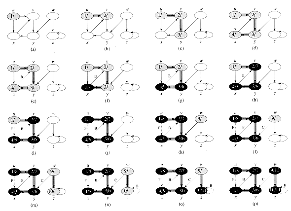

# Encapsule/jsgraph v0.5

_Graphs are mathematical abstractions that are useful for solving many types of problems in computer science. Consequently, these abstractions must also be represented in computer programs. - [Jeremy G. Siek](http://ecee.colorado.edu/~siek/resume.pdf)_

Encapsule/jsgraph is a functional port of directed graph container and algorithm suport from the [Boost C++ Graph Library](http://www.boost.org/doc/libs/1_56_0/libs/graph/doc/index.html) (BGL) to JavaScript that greatly simplifies the task of working with complex in-memory N-relational data structures on Node.js and HTML 5.

## Features

- Generic in-memory container for directed mathematical graph data and property sets.
- Directed graph tranposition algorithm (i.e. flip the edges).
- Breadth-first visit and search algorithms (full, non-recursive implementation with edge classification).
- Depth-first visit and search algorithms (full, non-recursive implementation with edge classicication).
- Core algorithms leverage the [visitor pattern](https://en.wikipedia.org/wiki/Visitor_pattern) for easy use and extension.
- Core breadth and depth-first traversal algorithms now support termination allowing for derived code to operate efficiently on large in-memory structures.
- Request/response object style API with helpful diagnostic error messages. Implementation does not throw or use exceptions.
- Implementation backed by 470 tests and Travis CI.

## API Overview

v0.5 jsgraph has the following public export object:

        var jsgraph = require('jsgraph');
        jsgraph === {
            directed: {
                create: [Function],
                transpose: [Function],
                breadthFirstTraverse: [Function],
                depthFirstTraverse: [Function],
                colors: { white: 0, gray: 1, black: 2 },
                createTraversalContext: [Function]
            }
        }

### DirectedGraph container object

**See also: [Object Reference: DirectedGraph](./docs/object-DirectedGraph.md)**

jsgraph's core directed graph container object, **DirectedGraph**, is constructed by a calling library export function `jsgraph.directed.create`:

        var jsgraph = require('jsgraph');
        var digraph = null;
        var response = jsgraph.directed.create(/*data or JSON*/);
        if (response.error) {
            console.log(response.error);
        } else {
            digraph = response.result;
            console.log(digraph.toJSON());
        }
        
        '{"vlist":[],"elist":[]}'
        
The `DirectedGraph` container object created by this process models "a graph" generically providing normalized access to its contents via the methods documented in the next sections.
            
#### DirectedGraph vertex methods

- addVertex({u: vertexId, p: ?}) - add a vertex and optional property data to the digraph
- isVertex(vertexId) - query the existence of a specific vertex in the graph
- removeVertex(vertexId) - remove a specific vertex and its properties from the graph
- getVertexProperty(vertexId) - get the properties data associated with a specific vertex
- setVertexProperty({u: vertexId, p: ?}) - set the properties data associated with a specific vertex
- inDegree(vertexId) - determine how many edges are directed at a specific vertex
- inEdges(vertexId) - get the list of edges directed at a specific vertex
- outDegree(vertexId) - determine how many edges are directed away from a specific vertex
- outEdges(vertexId) - get the list of edges directed away from a specific vertex

#### DirectedGraph edge methods

- addEdge({ e: { u: vertexId, v: vertexId }, p: ?}) - add edge and optional property data from vertex u to vertex v 
- isEdge({ u: vertexId, v: vertexId }) - query the existence of a specific edge in the graph
- removeEdge({ u: vertexId, v: vertexId }) - remove a specific edge and its properties from the graph
- getEdgeProperty({ u: vertexId, v: vertexId }) - get the properties data associated with a specific edge
- setEdgeProperty({ e: { u: vertexId, v: vertexId }, p: ?}) - set the properties data associated with a specific edge

#### DirectedGraph graph-scope methods

- verticesCount() - obtain the count of vertices in the container
- getVertices() - retrieve an array of ID strings for all vertices in the container
- edgesCount() - obtain the count of edges in the container
- getEdges() - retrieve an array of edge descriptor objects for all edges in the container
- getRootVertices() - retrieve an array of ID strings for all vertices that have in-degree zero
- getLeafVertices() - retrieve an array of ID strings for all vertices that have out-degree zero
- toObject() - serialize the DirectedGraph container to a JavaScript data object
- toJSON(replacer, space) - serialize the DirectedGraph container to a JSON string
- fromObject(dataObject) - import a jsgraph-format JavaScript data object into the container
- fromJSON(jsonString) - import jsgraph-format JSON string into the container

### Bundled Transforms & Algorithms

jsgraph bundles a small collection of powerful functions that operate on the data contained in a `DirectedGraph` container in useful ways.

Transform functions generate new `DirectedGraph` containers from existing container(s) applying some presribed filter, or transformation to the vertex and/or edge lists.

Algorithm functions are miniature agent processes that traverse the topology of a `DirectedGraph` container issuing callbacks to your derived client code at specified event points.

jsgraph algorithms use names and conventions documented in Chapter 23 of the Holy Book ([Introduction To Algorithms](https://mitpress.mit.edu/books/introduction-algorithms)). The reader is encouraged to review this material for a detailed discussion of the specific graph coloring algorithms, semantics of event callbacks, applications, and ideas for extensing the algorithms provided.

#### jsgraph.directed.transpose Transform

**See also: [Transform Reference: jsgraph.directed.transpose](./docs/transform-transpose.md)**

jsgraph currently provides a single 'transform' function, `jsgraph.directed.transpose` that constructs a new `DirectedGraph` that is a copy of an existing `DirectedGraph` with the edge direction reversed.

        var response = jsgraph.directed.transpose(digraph);
        if (response.error) {
            console.log(response.error);
        } else {
            console.log("Transposed digraph JSON: '" + response.result.toJSON() + "'.");
        }

#### jsgraph.directed.breadthFirstTraverse Algorithm

**See also: [Algorithm Reference: jsgraph.directed.breadthFirstTraverse](./docs/algorithm-bft.md)**

jsgraph function export `jsgraph.directed.breadthFirstTraverse` is a non-recursive imlementation of the classic breadth-first search and visit vertex discovery and edge classification protocols.

#### jsgraph.directed.depthFirstTraverse Algorithm

** See also: [Algorithm Reference: jsgraph.directed.depthFirstTraverse](./docs/algorithm-dft.md)**

jsgraph function export `jsgraph.directed.depthFirstTraverse` is a non-recursive implementation of the classic depth-first search and visit vertex discovery and edge classification protocols.

EDIT POINT

# Example

A simple JavaScript/jsgraph implementation of Depth-first search (DFS) example from [Introduction to Algorithms 23.3](http://staff.ustc.edu.cn/~csli/graduate/algorithms/book6/chap23.htm).

        // Use `require` to include the `jsgraph` module and select the `directed` graph namespace.
        var jsdigraph = require('jsgraph').directed;

        // Use JavaScript `new` operator to create a new, empty instance of DirectedGraph container object.
        var digraph = new jsdigraph.DirectedGraph();

        // Create an in-memory model of the topology of the directed graph (a) depicted above.
        digraph.addEdge("u", "v");
        digraph.addEdge("v", "y");
        digraph.addEdge("y", "x");
        digraph.addEdge("x", "v");
        digraph.addEdge("u", "x");
        digraph.addEdge("w", "y");
        digraph.addEdge("w", "z");
        digraph.addEdge("z", "z");

        // We're going to traverse the topology of the directed graph stored in `digraph` using
        // the depth-first search algorithm from jsgraph. Results will be stored in `dfsResults` array.
        var dfsResults = [];

        // Keep track of start, end times.
        var step = 0;
        var time = 0;

        // Define a DFS visitor object.
        // The properties are predefined function signatures that are called back iff defined.
        // Which callbacks we implement, and what we do in our callbacks is entirely up to us.
        // In this simple example we implement a simple logger that pushes each traversal step
        // into the `dfsResults` array for demonstration purposes.
        var dfsVisitorInterface = {
            initializeVertex: function(u, g) {
                dfsResults.push(step++ + " initializeVertex " + u);
            },
            startVertex: function (s, g) {
                dfsResults.push(step++ + " startVertex " + s);
            },
            discoverVertex: function(u, g) {
                dfsResults.push(step++ + " discoverVertex " + u + " at time " + time);
                time++;
            },
            examineEdge: function(u, v, g) {
                dfsResults.push(step++ + " examineEdge [" + u + "," + v + "]");
            },
            treeEdge: function(u, v, g) {
                dfsResults.push(step++ + " treeEdge [" + u + "," + v + "]");
            },
            backEdge: function(u, v, g) {
                dfsResults.push(step++ + " backEdge [" + u + "," + v + "]");
            },
            forwardOrCrossEdge: function(u, v, g) {
                dfsResults.push(step++ + " forwardOrCrossEdge [" + u + "," + v + "]");
            },
            finishVertex: function(u, g) {
                dfsResults.push(step++ + " finishVertex " + u + " at time " + time);
                time++;
            }
        };

        // jsgraph-provided algorithms are stateful and require a place to store their internal context.
        var dfsContext = jsgraph.directed.createDepthFirstSearchContext(digraph, dfsVisitorInterface);

        // Invoke the depth-first search algorithm from jsgraph. 
        jsgraph.directed.depthFirstSearch(digraph, dfsVisitorInterface, dfsContext);

        // Dump the `dfsResults` array to the console in JSON.
        console.log(JSON.stringify(dfsResults));

        > ["0 initializeVertex u",
           "1 initializeVertex v",
           "2 initializeVertex y",
           "3 initializeVertex x",
           "4 initializeVertex w",
           "5 initializeVertex z",
           "6 initializeVertex u",
           "7 initializeVertex v",
           "8 initializeVertex y",
           "9 initializeVertex x",
           "10 initializeVertex w",
           "11 initializeVertex z",
           "12 startVertex u",
           "13 discoverVertex u at time 1",
           "14 examineEdge [u,v]",
           "15 examineEdge [u,x]",
           "16 treeEdge [u,v]",
           "17 discoverVertex v at time 2",
           "18 examineEdge [v,y]",
           "19 treeEdge [v,y]",
           "20 discoverVertex y at time 3",
           "21 examineEdge [y,x]",
           "22 treeEdge [y,x]",
           "23 discoverVertex x at time 4",
           "24 examineEdge [x,v]",
           "25 backEdge [x,v]",
           "26 finishVertex x at time 5",
           "27 finishVertex y at time 6",
           "28 finishVertex v at time 7",
           "29 forwardOrCrossEdge [u,x]",
           "30 finishVertex u at time 8",
           "31 discoverVertex w at time 9",
           "32 examineEdge [w,y]",
           "33 forwardOrCrossEdge [w,y]",
           "34 examineEdge [w,z]",
           "35 treeEdge [w,z]",
           "36 discoverVertex z at time 10",
           "37 examineEdge [z,z]",
           "38 backEdge [z,z]",
           "39 finishVertex z at time 11",
           "40 finishVertex w at time 12"]

**<3**

# DirectedGraph Generic Container

jsgraph is inspired by the design and implementation of the [Boost C++ Graph Library](http://www.boost.org/doc/libs/1_56_0/libs/graph/doc/index.html) (BGL) that applies the C++ Standard Template Library concepts of generic containers and algorithms to mathematical graph datasets. 

        var jsgraph = require('jsgraph');
        var digraph = new jsgraph.DirectedGraph(JSON); // JSON is optional

## DirectedGraph.addVertex

        var vertex = digraph.addVertex(vertexId_, properties_);

**Parameters:**

- vertexId_ (required): a unique string identifying the vertex to add to the graph.
- properties_ (optional): reference to a property object to attach to the new vertex.

**Return:**

Returns a copy of the `vertexId_` in-parameter. If the vertex already exists, its properties are replaced if specified.

**Remarks:**

If a vertex with identifier `vertexId_` already exists in the graph, the call to `addVertex` is ignored.

## jsgraph.DirectedGraph.removeVertex

        digraph.removeVertex(vertexId_);

**Parameters:**

- vertexId_ (required): the unique string identifier of the vertex to remove from the graph

**Return:**

Returns true to indicate that the specified vertex is not part of the graph.

**Remarks:**

Removing a vertex automatically removes all the the vertex's edges (both in and out-edges are removed). 

## jsgraph.DirectedGraph.isVertex

        digraph.isVertex('foo');

**Return:**

Returns boolean true iff the specified vertex ID is part of the graph. Otherwise, false.

## jsgraph.DirectedGraph.verticesCount

        var count = digraph.verticesCount();

**Return:**

Integer indicating the number of vertices in this graph.

## jsgraph.DirectedGraph.getVertices

        vertices = digraph.getVertices();

**Return:**

Returns an array of string vertex identifiers.    

## jsgraph.DirectedGraph.getRootVertices

        var vertices = digraph.getRootVertices();

**Return:**

Returns an array of identifier strings indicating the set of root vertices in the graph (i.e. the set of vertices with in-degree zero).

## jsgraph.Directedgraph.getLeafVertices

        var vertices = digraph.getLeafVertices();

**Return:**

Returns an array of identifier strings indicating the set of leaf vertices in the graph (i.e. the set of vertices with out-degree zero).

## jsgraph.DirectedGraph.getVertexPropertyObject

        var properties = digraph.getVertexPropertyObject(vertexId_);

**Parameters:**

- vertexId_ (requierd): the unique string identifying the vertex to query.

**Return:**

Returns a reference to the property object attached to the specified vertex when it was added to the graph.

## jsgraph.DirectedGraph.setVertexPropertyObject

        var properties = digraph.getVertexPropertyObject(vertexId_, ref_);

**Parameters:**

- vertexId_ (requierd): the unique string identifying the vertex to query.
- ref_: whatever you want as long as it's serializable to JSON

**Return:**

Returns true if set. Otherwise false if the specified vertex is not part of the graph.

## jsgraph.DirectedGraph.inEdges

        var edgeArray = digraph.inEdges(vertexId_);

**Parameters:**

- vertexId_ (required): the unique string identifying the vertex to query.

**Return:**

Returns an array of edge descriptor objects specifying the source and sink vertex ID's of each of the specified vertex's in-edges.

## jsgraph.DirectedGraph.outEdges

        var edgeArray = digraph.outEdges(vertexId_);

**Parameters:**

- vertexId_ (requierd): the unique string identifying the vertex to query.

**Return:**

Returns an array of edge descriptor objects specifiy the source and sink vertex ID's of each of the specified vertex's out-edges.

## jsgraph.DirectedGraph.inDegree

        var degree = digraph.inDegree(vertexId_);

**Parameters:**

- vertexId_ (requierd): the unique string identifying the vertex to query.

**Return:**

Integer indicating the in-degree of the specific vertex.

## jsgraph.DirectedGraph.outDegree

        var degree = digraph.outDegree(vertexId_);

**Parameters:**

- vertexId_ (requierd): the unique string identifying the vertex to query.

**Return:**

Integer indicating the out-degree of the specific vertex.

## jsgraph.DirectedGraph.addEdge

        var edge = digraph.addEdge(vertexIdU_, vertexIdV_, properties_);

**Parameters:**

- vertexIdU_ (required): a unqique string identifying the directed edge's source vertex, U.
- vertexIdV_ (required): a unqique string identifying the directed edge's sink vertex, V.
- properties_ (optional): reference to a property object to attach to the new edge.

**Return:**

Returns an edge descriptor object containing the identifiers of the U and V vertices:

        { u: 'vertex U ID string', v: 'vertex V ID string' }

**Remarks:**

If a vertex or vertices specified in a call to `addEdge` do not exist, they are added automatically and then the edge is added without associated property objects (you'll need to assign these manually by vertex ID in this situation).

## jsgraph.DirectedGraph.removeEdge

        digraph.removeEdge(uid, vid);

**Parameters:**

- uid (required): the unqiue string identifying the directed edge's source vertex, U.
- vid (required): the unique string identifying the directed edge's sink vertex, V.

**Return:**

Returns true to indicate that the specified edge is not part of the graph.

## jsgraph.DirectedGraph.isEdge

        digraph.isEdge(uid,vid);

**Parameters:**

- uid (required): the unique string identifying the directed edge's source vertex, U.
- vid (required): the unique string identifying the directed edge's sink vertex, V.

**Return:**

Return true if the edge is part of the graph. Otherwise, false.

## jsgraph.DirectedGraph.edgesCount

        var count = digraph.edgesCount();

**Return:**

Integer indicating the number of edges in this graph.

## jsgraph.DirectedGraph.getEdges

        var edges = digraph.getEdges()

**Returns:**

Returns an array of edge descriptor objects with `u` and `v` properties set to tail and head vertex identifier strings respectively.

## jsgraph.DirectedGraph.getEdgeProperty

        var properties = digraph.getEdgePropertyObject(vertexIdU_, vertexIdV);

**Parameters:**

- vertexIdU_ (required): the unqiue string identifying the directed edge's source vertex, U.
- vertexIdV_  (required): the unique string identifying the directed edge's sink vertex, V.

**Return:**

Returns a reference to the property object attached to the specified edge when it was added to the graph.

## jsgraph.DirectedGraph.setEdgeProperty

        var properties = digraph.getEdgePropertyObject(vertexIdU_, vertexIdV, ref_);

**Parameters:**

- vertexIdU_ (required): the unqiue string identifying the directed edge's source vertex, U.
- vertexIdV_  (required): the unique string identifying the directed edge's sink vertex, V.
- ref_: whatever you want as long as it's serializable to JSON

**Return:**

Returns the edge descriptor object.

## jsgraph.DirectedGraph.toJSON

        var digraph = new DirectedGraph();
        digraph.toJSON(undefined,4);

**Returns:**

JSON-encoded serialization of the contents of the DirectedGraph container. 

**Remarks:**

Pass the JSON string returned by DirectedGraph.toJSON to method DirectedGraph.importJSON or the DirectedGraph constructor to import.

## jsgraph.DirectedGraph.importJSON

        digraph.DirectedGraph.importJSON(JSON);

** Remarks:**

JSON import adds vertices and edges to the current DirectedGraph container from an external JSON source. Duplicates are ignored.

# Generic Transforms

## jsgraph.directed.transpose

        var transposedDigraph = jsgraph.transpose(digraphIn_);

**Parameters:**

- digraphIn_ (required): a reference to a previously-constructed and initialized DirectedGraph object.

**Return:**

Returns a new instance of DirectedGraph that reverses the direction of all the edges in the source graph.

# Generic Algorithms

jsgraph provides several useful graph algorithms implemented using the visitor pattern in a manner that seeks to emulate the [Boost C++ Graph Library: Visitor Concepts](http://www.boost.org/doc/libs/1_56_0/libs/graph/doc/visitor_concepts.html).

Unless otherwise noted, all implementations are non-recursive to conserve stack space when traversing very large in-memory graphs.

## BFV / BFS

### breadthFirstSearchVisitor object interface

To leverage the `breadthFirstVisit` and `breadthFirstSearch` algorithms, you must implement a breadth-first search visitor object and provide callback implementations(s):

        var breadthFirstVisitorInterface = {
            initializeVertex: function(vertexId_, digraph_),
            discoverVertex: function(vertexId_, digraph_),
            startVertex: function(vertexId_, digraph_),
            examineVertex: function(vertexId_, digraph_),
            examineEdge: function(vertexIdU_, vertexIdV_, digraph_),
            treeEdge: function(vertexIdU_, vertexIdV_, digraph_),
            nonTreeEdge: function(vertexIdU_, vertexIdV_, digraph_),
            grayTarget: function(vertexIdU_, vertexIdV_, digraph_),
            blackTarget: function(vertexIdU_, vertexIdV_, digraph_),
            finishVertex: function(vertexId_, digraph_)
        };

All callback functions are optional; implement only those you require.

- **initializeVertex** - This invoked on every vertex of the graph before the start of the graph search.
- **discoverVertex** - This is invoked when a vertex is encountered for the first time
- **examineVertex** - This is invoked on a vertex as it is popped from the queue. This happens immediately before examine_edge() is invoked on each of the out-edges of vertex u.
- **examineEdge** - This is invoked on every out-edge of each vertex after it is discovered.
- **treeEdge** - This in invoked on edge edge as it becomes a member of the edges that form the search tree.
- **nonTreeEdge** - This is invoked on back or cross edges.
- **grayTarget** - This is invoked on the subset of non-tree edges whose target vertex is colored grat at the time of examination. The color gray indicates that the vertex is currently in the queue.
- blackTarget - This is invoked on a subset of the edges whose target vertex is colored black at the time of examination. The color black indicates that the vertex has been removed from the queue.
- finishVertex - This is invoked on a vertex after all of its out edges have been added to the search tree and all adjacent vertices have been discovered (but before the out-edges of the adjacent vertices have been examined).

Please see the [Boost C++ Graph Library: BFS Visitor Concept](http://www.boost.org/doc/libs/1_55_0/libs/graph/doc/BFSVisitor.html) documentation for a complete discussion of API semantics.

### createBreadthFirstSearchContext

Prior to calling either `breadthFirstVisit` or `breadthFirstSearch` you must initialize a context object for the algorithm's internal state.

      var bfsContext = jsgraph.directed.createBreadthFirstSearchContext(digraph_, visitorInterface_);

**Parameters:**

- digraph_ (required): a reference to a previously-constructed DirectedGraph object.
- visitorInterface_ (required): a reference to your application-specific BFS visitor interface object

**Remarks:**

You need to initialize a new context object every time you affect a new graph traversal.

### breadthFirstVisit

        jsgraph.directed.breadthFirstVisit(digraph_, context_, startVertexId_, visitorInterface_);

**Parameters:**

- digraph_ (required): a reference to a previously-constructed DirectedGraph object.
- context_ (required): a reference to your breadth-first search context object.
- startVertexId_ (required): the string identifier of vertex at which to start the visit traversal.
- visitorInterface_ (required): a reference to your application-specific BFS visitor interface object.

**Return:**

None.

### breadthFirstSearch

        jsgraph.directed.breadthFirstSearch(digraph_, context_, startVertexArray_, visitorInterface_);

**Parameters:**

- digraph_ (required): a reference to a previously-constructed DirectedGraph object.
- context_ (required): a reference to your breadth-first search context object.
- startVertexArray_ (required): as array of string identifiers of the vertices to visit breadth-first.
- visitorInterface_ (required): a reference to your application-specific BFS visitor interface object.

**Return:**

None.

## DFV / DFS

### depthfirstSearchVisitor object interface

To leverage the `depthFirstVisit' and 'depthFirstSearch' algorithms, you must implement a depth-first search visitor object and provide callback implementation(s):

        var depthFirstVisitorInterface = {
            initializeVertex: function(vertexId_, digraph_),
            startVertex: function(vertexId_, digraph_),
            discoverVertex: function(vertexId_, digraph_),
            examineEdge: function(vertexIdU_, vertexIdV_, digraph_),
            treeEdge: function(vertexIdU_, vertexIdV_, digraph_),
            backEdge: function(vertexIdU_, vertexIdV_, digraph_),
            forwardOrCrossEdge: function(vertexIdU_, vertexIdV_, digraph_),
            finishVertex(vertexId_, digraph_)
        };

All callback functions are optional; implement only those you require.

- **initializeVertex** - This is invoked on every vertex of the graph before the start of the search.
- **startVertex** - This is invoked on the source vertex once before the start of the search.
- **discoverVertex** - This is invoked when a vertex is encountered for the first time.
- **examineEdge** - This is invoked on every out-edge of each vertex after it is discovered.
- **treeEdge** - This is invoked on each edge as it becomes a member of the edges that form the search tree.
- **backEdge** - This is invoked on the back edges in the graph. For an undirected graph there is some ambiguity between tree edges and back edges since the edge (u,v) and (v,u) are the same edge, but both the tree_edge() and back_edge() functions will be invoked. One way to resolve this ambiguity is to record the tree edges, and then disregard the back-edges that are already marked as tree edges. An easy way to record tree edges is to record predecessors at the tree_edge event point.
- **forwardOrCrossEdge** - This is invoked on forward or cross edges in the graph. In an undirected graph this method is never called.
- **finishEdge** - This is invoked on each non-tree edge as well as on each tree edge after finish_vertex has been called on its target vertex.
- **finishVertex** - This is invoked on vertex u after finish_vertex has been called for all the vertices in the DFS-tree rooted at vertex u. If vertex u is a leaf in the DFS-tree, then the finish_vertex function is called on u after all the out-edges of u have been examined.

Please see the [Boost C++ Graph Library: DFS Visitor Concept](http://www.boost.org/doc/libs/1_55_0/libs/graph/doc/DFSVisitor.html) documentation for a complete discussion of API semantics.

### jsgraph.directed.createDepthFirstSearchContext

Prior to calling either `depthFirstVisit` you must initialize a context object for the algorithm's internal state.

        var dfsContext = jsgraph.directed.createDepthFirstSearchContext(digraph_, visitorInterface_);

**Parameters:**

- digraph_ (required): a reference to a previously-constructed DirectedGraph object.
- visitorInterface_ (required): a reference to your application-specific BFS visitor interface object

**Remarks:**

You need to initialize a new context object every time you affect a new graph traversal.

This step is taken care of automatically by `depthFirstSearch` but not the lower-level `depthFirstVisit` algorithm implementation.

### jsgraph.directed.depthFirstVisit

        jsgraph.directed.depthFirstVisit(digraph_, context_, startVertexId_, visitorInterface_);

**Parameters:**

- digraph_ (required): a reference to a previously-constructed DirectedGraph object.
- context_ (required): a reference to your depth-first search context object.
- startVertexArray_ (required): as array of string identifiers of the vertices to visit depth-first search.
- visitorInterface_ (required): a reference to your application-specific BFS visitor interface object.

**Return:**

None.

**Remarks:**

Please see the [Boost C++ Graph Library: DFS Visitor Concept](http://www.boost.org/doc/libs/1_55_0/libs/graph/doc/DFSVisitor.html) documentation for a complete discussion of API semantics.

### jsgraph.directed.depthFirstSearch

        jsgraph.directed.depthFirstSearch(digraph_, visitorInterface_);

**Parameters:**

- digraph_ (required): a reference to a previously-constructed DirectedGraph object.
- visitorInterface_ (required): a reference to your application-specific BFS visitor interface object

**Return:**

None.

**Remarks:**

Please see the [Boost C++ Graph Library: DFS Visitor Concept](http://www.boost.org/doc/libs/1_55_0/libs/graph/doc/DFSVisitor.html) documentation for a complete discussion of API semantics.
        
# Notes

[1] Support for undirected graph data sets, related algorithms is planned for a future jsgraph release.

# JSON Format

jsgraph supports a very simple JSON format for representing the contents of a DirectedGraph container. An empty DirectedGraph container's JSON looks like this:

        '{"vertices":[],"edges":[]}'

The `vertices` array contains vertex descriptor objects that look like this:

        '{"id":"test","props":"whatever we want"}'

... and the `edges` array contains edge descriptor object that look like this:

        '{"u":"apple","v":"orange","props":"not the same"}'

# Acknowledgements

Thanks to [Jeremy Seik](http://wphomes.soic.indiana.edu/jsiek/) for writing the BGL.

Copyright &copy; 2014-2015 [Christopher D. Russell](https://github.com/ChrisRus) / [Encapsule Project](https://github.com/encapsule)

