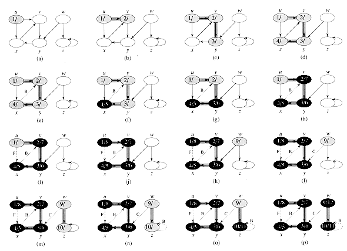

# Encapsule/jsgraph example

**NOTE: This is a v0.4 example I haven't had time to update to the v0.5 API.**

## Depth-first traversal

A simple JavaScript/jsgraph implementation of Depth-first search (DFS) example from [Introduction to Algorithms 23.3](http://staff.ustc.edu.cn/~csli/graduate/algorithms/book6/chap23.htm).

        // Use `require` to include the `jsgraph` module and select the `directed` graph namespace.
        var jsdigraph = require('jsgraph').directed;

        // Use JavaScript `new` operator to create a new, empty instance of DirectedGraph container object.
        var digraph = new jsdigraph.DirectedGraph();

        // Create an in-memory model of the topology of the directed graph (a) depicted above.
        digraph.addEdge("u", "v");
        digraph.addEdge("v", "y");
        digraph.addEdge("y", "x");
        digraph.addEdge("x", "v");
        digraph.addEdge("u", "x");
        digraph.addEdge("w", "y");
        digraph.addEdge("w", "z");
        digraph.addEdge("z", "z");

        // We're going to traverse the topology of the directed graph stored in `digraph` using
        // the depth-first search algorithm from jsgraph. Results will be stored in `dfsResults` array.
        var dfsResults = [];

        // Keep track of start, end times.
        var step = 0;
        var time = 0;

        // Define a DFS visitor object.
        // The properties are predefined function signatures that are called back iff defined.
        // Which callbacks we implement, and what we do in our callbacks is entirely up to us.
        // In this simple example we implement a simple logger that pushes each traversal step
        // into the `dfsResults` array for demonstration purposes.
        var dfsVisitorInterface = {
            initializeVertex: function(u, g) {
                dfsResults.push(step++ + " initializeVertex " + u);
            },
            startVertex: function (s, g) {
                dfsResults.push(step++ + " startVertex " + s);
            },
            discoverVertex: function(u, g) {
                dfsResults.push(step++ + " discoverVertex " + u + " at time " + time);
                time++;
            },
            examineEdge: function(u, v, g) {
                dfsResults.push(step++ + " examineEdge [" + u + "," + v + "]");
            },
            treeEdge: function(u, v, g) {
                dfsResults.push(step++ + " treeEdge [" + u + "," + v + "]");
            },
            backEdge: function(u, v, g) {
                dfsResults.push(step++ + " backEdge [" + u + "," + v + "]");
            },
            forwardOrCrossEdge: function(u, v, g) {
                dfsResults.push(step++ + " forwardOrCrossEdge [" + u + "," + v + "]");
            },
            finishVertex: function(u, g) {
                dfsResults.push(step++ + " finishVertex " + u + " at time " + time);
                time++;
            }
        };

        // jsgraph-provided algorithms are stateful and require a place to store their internal context.
        var dfsContext = jsgraph.directed.createDepthFirstSearchContext(digraph, dfsVisitorInterface);

        // Invoke the depth-first search algorithm from jsgraph. 
        jsgraph.directed.depthFirstSearch(digraph, dfsVisitorInterface, dfsContext);

        // Dump the `dfsResults` array to the console in JSON.
        console.log(JSON.stringify(dfsResults));

        > ["0 initializeVertex u",
           "1 initializeVertex v",
           "2 initializeVertex y",
           "3 initializeVertex x",
           "4 initializeVertex w",
           "5 initializeVertex z",
           "6 initializeVertex u",
           "7 initializeVertex v",
           "8 initializeVertex y",
           "9 initializeVertex x",
           "10 initializeVertex w",
           "11 initializeVertex z",
           "12 startVertex u",
           "13 discoverVertex u at time 1",
           "14 examineEdge [u,v]",
           "15 examineEdge [u,x]",
           "16 treeEdge [u,v]",
           "17 discoverVertex v at time 2",
           "18 examineEdge [v,y]",
           "19 treeEdge [v,y]",
           "20 discoverVertex y at time 3",
           "21 examineEdge [y,x]",
           "22 treeEdge [y,x]",
           "23 discoverVertex x at time 4",
           "24 examineEdge [x,v]",
           "25 backEdge [x,v]",
           "26 finishVertex x at time 5",
           "27 finishVertex y at time 6",
           "28 finishVertex v at time 7",
           "29 forwardOrCrossEdge [u,x]",
           "30 finishVertex u at time 8",
           "31 discoverVertex w at time 9",
           "32 examineEdge [w,y]",
           "33 forwardOrCrossEdge [w,y]",
           "34 examineEdge [w,z]",
           "35 treeEdge [w,z]",
           "36 discoverVertex z at time 10",
           "37 examineEdge [z,z]",
           "38 backEdge [z,z]",
           "39 finishVertex z at time 11",
           "40 finishVertex w at time 12"]

**<3**

Copyright &copy; 2014-2015 [Christopher D. Russell](https://github.com/ChrisRus)

